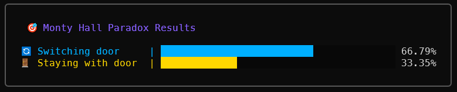
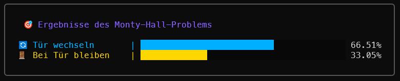
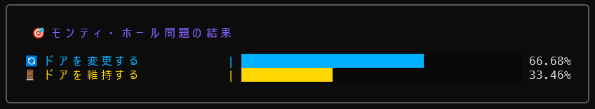

#  Monty Hall Simulator in Go

> A stylish, multi-language command-line simulation of the famous Monty Hall Paradox, built with Go and the Charm Lipgloss library.

This project provides an interactive and visually appealing way to understand the counter-intuitive probabilities of the Monty Hall problem. It clearly demonstrates that switching your choice is the winning strategy.

## ✨ Features

- **Dual Strategy Simulation**: Runs simulations for both "switching" and "staying" strategies.
- **Beautiful CLI Output**: Uses `lipgloss` to create a modern and colorful interface in the terminal.
- **Internationalization (i18n)**: Supports 8 languages (EN, PT, ES, DE, FR, KO, ZH, JA).
- **Auto-Language Detection**: Automatically detects the user's system language on the first run.
- **Persistent Configuration**: Saves the user's language choice for future sessions.
- **Built-in Help Screen**: Provides clear instructions if run without parameters.

## 🎬 Demo


## 🚀 How to Use

### Prerequisites

- [Go](https://golang.org/dl/) (version 1.18 or higher)
- [Git](https://git-scm.com/)

### Installation & Running

1.  **Clone the repository:**
    ```sh
    git clone <your-repository-url>
    cd <repository-directory>
    ```

2.  **Install dependencies:**
    The program uses external modules. `go run` will handle them automatically, but you can also fetch them manually:
    ```sh
    go mod tidy
    ```
    *or*
    ```sh
    go get [github.com/charmbracelet/lipgloss](https://github.com/charmbracelet/lipgloss)
    go get [github.com/cloudfoundry/jibber_jabber](https://github.com/cloudfoundry/jibber_jabber)
    ```

3.  **Run the simulation:**
    Provide the number of trials as an argument. On the first run, the program will detect your system language.
    ```sh
    go run montyhall.go 10000
    ```

4.  **Change the language:**
    Use the `-L` flag to set a different language. This choice will be saved for future runs.
    ```sh
    # Run in Japanese
    go run montyhall.go -L ja 5000

    # Run in German
    go run montyhall.go -L de 20000
    ```
5.  **View the help screen:**
    Run the program without any arguments to see the help menu.
    ```sh
    go run montyhall.go
    ```

## 🌐 Languages Showcase

The interface is fully translated, providing a native experience for users around the world.

#### English (`en`)



#### German (`de`)



#### Japanese (`ja`)

## 🛠️ Built With

- [Go](https://golang.org/) - The core programming language.
- [Charm Lipgloss](https://github.com/charmbracelet/lipgloss) - For creating the beautiful terminal UI.
- [Jibber Jabber](https://github.com/cloudfoundry/jibber_jabber) - For cross-platform locale detection.

---
